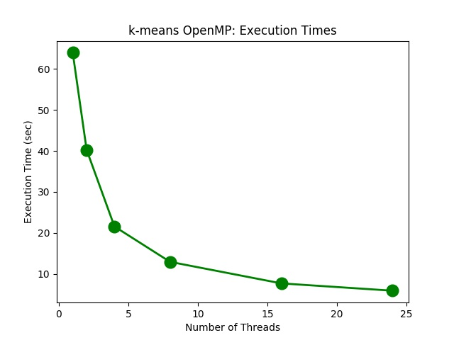

## Project Checkpoint Report
# Shreya Bali (sbali), Kusha Maharshi (kmaharsh)
## Updated November 30, 2020

# 1 Overview
Our project is titled Parallel Image Processing Toolbox. We aim to parallelize image processing algorithms like k-means for color segmentation, Otsu binarization and edge detection.  We are implementing these algorithms in C++ sequentially and using OpenMP and CUDA in parallel.

# 2  Progress
Thus far, we have completed the code for k-means in sequential C++, OpenMP and CUDA. We are seeing promising results in OpenMP, but we would like to make some more optimizations to the CUDA code.  We have also finished thesequential and OpenMP code for Otsu Binarization. Initially, we only intended to do k-means, and then work with low diameter de-composition if time permitted.  Fortunately, we are ahead of schedule and havethus decided to expand the scope of our project.  Our next goal is to add the CUDA implementation of Otsu Binarization and sequential,  OpenMP as well as CUDA code for edge detection. We have also tested and compiled the results of the above mentioned implemen-tations.  Some of them are included below.

# 3  Preliminary Results
First, note that k-means on a 321 x 481image in sequence takes 63.94 seconds when number of iterations it is run for = 32384 and k=3. We present the graph of execution times on OpenMP with different number ofthreads/processors (1,2,4,8,16,24).  We notice near linear speedup.1
We  tested  our  implementation  on  different  iteration  in  k-means  as  well. It did not seem to be the case that range of iterations affects the effectiveness of parallelization,  which  makes  sense  given  that  no  parallelization  happens  overiterations. 

In  CUDA,  for  k-means  (k=3),  we  notice  140.025549  seconds  are  required  for32384 iterations.  For other number of iterations tested, CUDA times are consis-tently approx.  2x the sequential times.  This is likely due to a small fundamentalbug, which we aim to fix as the next step.For Otsu binarization on image of dimensions10315 x 7049, we get the follow-ing execution times with different number of threads/processors (1,2,4,8,16,24)on OpenMP.

While some speedup is noticed in all cases with respect to sequential code, wedo not observe linear speedup.We  describe  some  of  our  implementation  details  and  corresponding  observa-tions below:
1.   When  implementing  k-means  and  Otsu  in  OpenMP,  we  realized  that  allowing contention when an operation is parallelized over pixels a generally bad idea.  We tried to reduce the number of sequential loops in our algorithms by including some operations within critical regions in less number of loops.  In general, this was a bad strategy due to terrible contention as a result of a very high number of pixels.  Here, the contention dampened the benefits of parallelization.

2.  For k-means, in line with our observations, we did not yet expect speedups with respect to k.  In OpenMP/CUDA, we currently do not parallelize over k.The only operation truly parallelizable over k is when we update the means ofeach cluster.  We just decided to parallelize over the pixels and apply a parallelreduce/scan  to  update  these  cluster  means,  where  each  cluster  is  handled  in sequence.  We aim to test nested parallelization over k as well.3.   We  found  exclusive  scan  in  parallel  to  be  very  useful.   Using  it  for  sum-mation  in  CUDA  k-means  and  for  cumulative  histogram  generation  in  Otsu Binarization improved our speedups significantly.

4.  It seems that the non-linear and inconsistent speedups in Otsu’s OpenMP case are due to the overhead of parallelization.  We have several loops, all withindifferent pragmas and several shared variable accesses as well.  We will aim too ptimize this to get more linear and consistent speedups.

# 4  Poster Session
We plan to include plots and key observations in our poster session.  We will show how the execution times change with different parameters for algorithmswhile parallelizing in CUDA and in OpenMP over different number of processors.Additionally, we will include the resulting images from applying the techniqueswe have implemented on certain input images.

# 5  Concerns
Currently,  we  are  not  seeing  speedup  relative  to  sequential  code  in  CUDA. Interestingly, it is exactly double the time.  This makes us think there is a smallbut fundamental bug somewhere in the implementation.  We plan to fix this asan immediate next step. Additionally, we don’t have access to the submitjob functionality on Latedays. We have been able to use bridges with some different make options, but havingthat access would help us check our results on Latedays as well.

# 6  Remaining Goals
Fix CUDA bug 12/1 Kusha
Otsu CUDA 12/1 Kusha
Edge Detection Seq 12/2 Shreya 
Edge Detection OpenMP 12/3 Shreya 
Edge Detection CUDA 12/5 Kusha
Optimizations 12/8 Both
Testing, Analysis 12/11 Both 
Writeup, Presentation 12/14 Both
